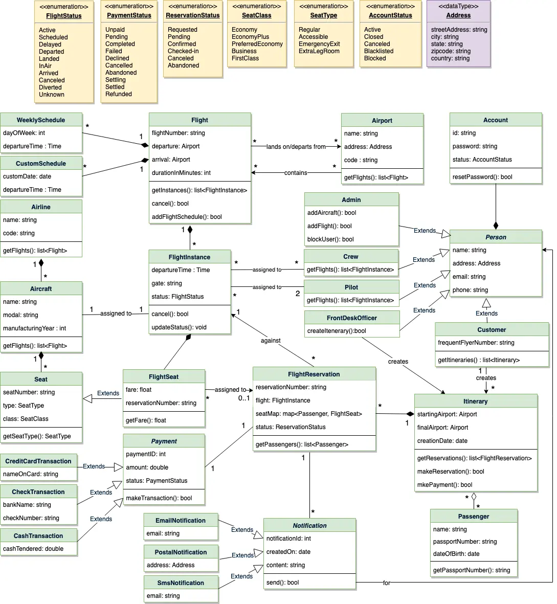

**System Requirements:
**

1. Customers should be able to search for flights for a given date and source/destination airport.

2. Customers should be able to reserve a ticket for any scheduled flight. Customers can also build a multi-flight itinerary.

3. Users of the system can check flight schedules, their departure time, available seats, arrival time, and other flight details.

4. Customers can make reservations for multiple passengers under one itinerary.

5. Only the admin of the system can add new aircrafts, flights, and flight schedules. Admin can cancel any pre-scheduled flight (all stakeholders will be notified).

6. Customers can cancel their reservation and itinerary.

7. The system should be able to handle the assignment of pilots and crew members to flights.

8. The system should be able to handle payments for reservations.

9. The system should be able to send notifications to customers whenever a reservation is made/modified or there is an update for their flights.

 
